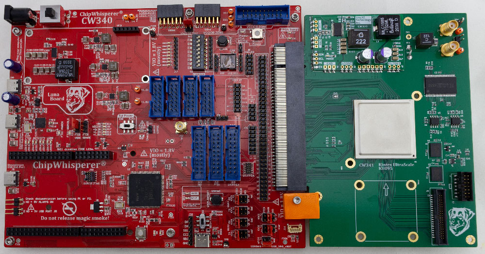
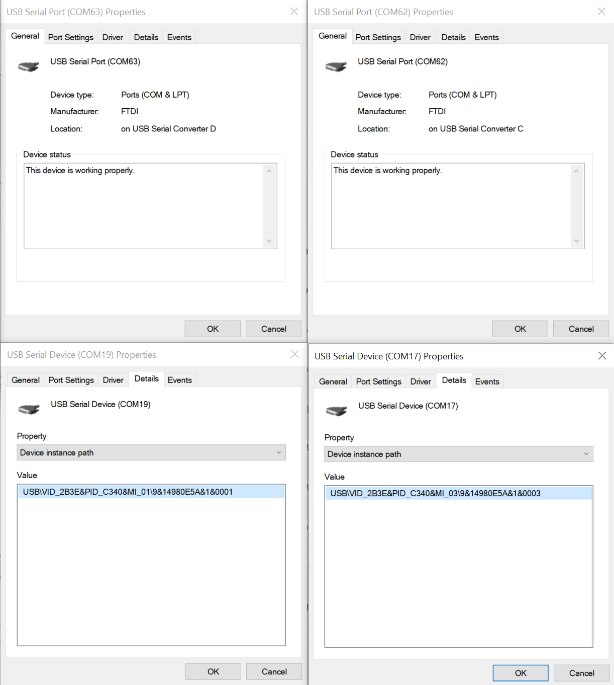

# CW340 Luna Board (OpenTitan Baseboard)


The ChipWhisperer CW340 "Luna Board" is an advanced evaluation platform for FPGA-based security SoC, RoT, or HSM based designs. It is specifically designed to meet the needs of security evaluation purposes, while having the features you would expect in an easy-to-use FPGA development board.

The CW340 is designed specifically for working with the OpenTitan design, either in FPGA emulation or with a production silicon device.

!!! tip "Quick Reference to Schematics and More"
    For the schematic see [Schematic](#reference-material-schematics) section.
    For FPGA examples see [GITHub Repo](https://github.com/newaetech/cw340-luna-board).
	For PCB source files see [GITHub Repo](https://github.com/newaetech/cw340-luna-board)

This board includes a programmable microcontroller that communicates with the target FPGA, as well as a generic FTDI interface for serial & JTAg interface. The microcontroller is responsible for tasks including:

* Configuring/reconfiguring the FPGA using serial or SelectMAP.
* Monitor the FPGA temperature, controlling fans, shutting down power if entering over-temp situation.
* Adjusting the core voltage.
* Controlling the on-board PLL to set required clock frequency.
* Allowing power cycling of the FPGA target.
* Address/data bus which can be used as 30 computer-controller GPIO pins instead.
* Generic SPI interface.

In addition, the board includes several useful features for development of SoC like devices:

* 1x QSPI sockets - one with 1.8V fixed VCC, one with adjustable VCC.
* Standard JTAG headers that are compatible with most Arm & RISC-V debug probes.
* USB with PHY chip.
* PMOD headers
* Large card-edge connector for the FPGA submodule.


## CW341 Kintex UltraScale (OpenTitan Emulation) FPGA Board

The CW340 "OT KIT" edition includes the CW341 Kintex UltraScale FPGA board. This board has a separate
documentation page. Briefly, features of the CW341 include:

* SRAM and HyperRam for memory expansion.
* Simple PCB design makes it possible to build your own (especially useful if you have stock of the FPGAs).
* JTAG and expansion headers on-board.
* Separate VCC-INT power supply module to further simplify building your own board.

The FPGA board also contains multiple features specific for power analysis & fault injection testing:

* Multi-stage filtering of VCC-INT power supplies to reduce noise.
* On-board inductive "shunt" for power measurements.
* Bridgeable test points for performing other operations with VCC-INT supply.
* SMA connectors for voltage fault injection.
* Cross-flow fans allow access to die for EM probing or EMFI fault injection.
* BGA is mounted with open area to allow removal of heat spreader with minimal risk.


## Usage

### OpenTitan

If you want to use OpenTitan with the CW340, we recommend following their instructions at https://github.com/lowRISC/opentitan/blob/master/doc/getting_started/setup_fpga.md

### Custom BitStreams

If instead you want to build and develop your own bitstreams, you may find it more convenient to
use the ChipWhisperer Python API. Using the board in this way is very similar to using the
CW305 or CW310 boards:

```python
# program bitstream
import chipwhisperer as cw
target = cw.target(None, cw.targets.CW340, bsfile="/path/to/bitstream.bit", force=True)

# Set PLLs
target.pll.pll_enable_set(True)
target.pll.pll_outenable_set(False, 0)
target.pll.pll_outenable_set(True, 1)
target.pll.pll_outenable_set(False, 2)

# run at 10 MHz:
target.pll.pll_outfreq_set(10E6, 1)
```

### UART

The CW340 has two options for using UART: 2 FTDI UART channels, and a custom SAM3X microcontroller
driver with 2 channels. `lsusb` on Linux and Device Manager on Windows can be used to
figure out which serial ports are associated with which. The following image shows the two FTDI
channels on the top and the two SAM3X channels on the bottom:



The following is an output from `lsusb -tv`:

### Jumpers

#### UART Jumpers (JP1-JP4)

The default UART IO pins for OpenTitan (OT_IOC3, OT_IOC4, OT_IOA0, and OT_IOA1) can be routed to the following locations:

1. Onboard FTDI UART chip
1. Onboard SAM3X microcontroller
1. Header pins (J18)

For most situations, we recommend routing to the FTDI UART pins.

#### Other Jumpers

Most other jumpers on the CW340 will not need to be touched by the user. They do the following:

* JP5 routes the OpenTitan power on reset pin to either a switch (USRSW0) or J29
* JP6 routes 1.8V to User SPI 1
* JP7 has GPIOL0 and GPIOL1 of FTDI channel D
* JP8 has PLL_CLK2 and the /USB_CE signal
* JP9 can be used to set VCCIOB to either 1.2V, 1.8V, or 3.3V
* JP11 and JP12 set OT_IOC5 and OT_IOC8, respectively, to either FTDI control or SAM3X control
* JP13 sets the 1.8V supply for the FTDI chip to either come from the SAM 1.8V regulator, or from a separate regulator 

## Firmware Upgrade

If you need to upgrade the firmware on the SAM3X (control microcontroller), this is currently done through two steps:

1. Erase the SAM3X, causing it to enter bootloader mode.
2. Program the SAM3X with the new firmware.

See the following for details of these steps.

!!! tip "Automatic Bootloader"
    Our other devices have a simplified "automatic" bootloader programmer - currently the CW340 firmware isn't distributed with ChipWhisperer, so for now use the following manual method.

### Step 1: Erasing the SAM3X

This can be done in two ways. Via Python:

```
import chipwhisperer as cw
target = cw.target(None, cw.targets.CW340)
programmer = cw.SAMFWLoader(scope=target)
programmer.enter_bootloader(really_enter=True)
```

Alternative, short the jumper holes marked "ERASE" (J20) with a paperclip, tweezers, etc.

If this part is successful, the leds D23 and D9 will be dimly lit. The CW340 will then **re-enumerate as a serial port**.

### Step 2: Reprogramming the SAM3X

In the following step, you may need to add explicit permission for the bootloader serial port. This is a different USB interface than is normally used by the device.

Get the latest firmware from GIT, note that the file is stored as part of the CW340 repo:

```
wget https://github.com/newaetech/cw310-bergen-board/raw/main/microfw/CW310/src/CW340.bin
```

And then:

```python
import chipwhisperer as cw
programmer = cw.SAMFWLoader(scope=None)
programmer.program('COM3', 'CW340.bin')
```

If this is successful you will see something like:

```
Opening firmware...
Opened!
Connecting...
b'\n\r'
Connected!
Erasing...
Erased!
Programming file CW340.bin...
Programmed!
Verifying...
Verify OK!
Bootloader disabled. Please power cycle device.
```

Press the "USB RST" button (SW5) on the board or power cycle it.


!!! tip "No Touch Bootloader"
    The latest git will support an automatic bootloader which does not require you to power cycle or touch the physical board. If your board automatically re-enumerates, you do not need to do the "USB RST" command.

## Reference Material (Schematics)

* [View schematics online](https://github.com/newaetech/cw340-luna-board/blob/main/docs/NPCA-CW340-LUNABOARD-05.PDF)
* [Download PDF of Schematics](https://github.com/newaetech/cw340-luna-board/raw/main/docs/NPCA-CW340-LUNABOARD-05.PDF)

## Errata

### PLL

PLLs 1 and 2 are swapped from the CW305. The ChipWhisperer Python library swaps them back such that setting
PLL1 sets PLL_CLK1 on the schematic. Third party libraries may or may not perform this swap.